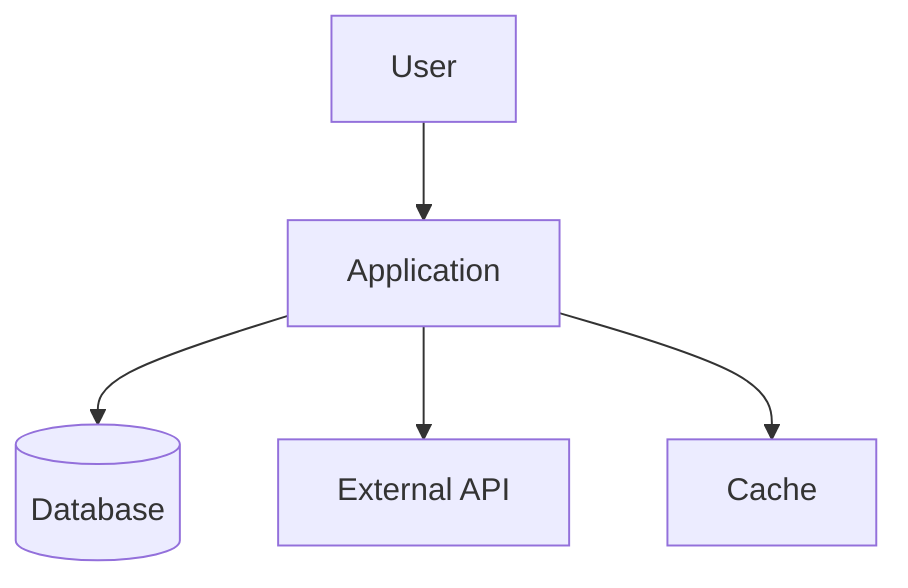
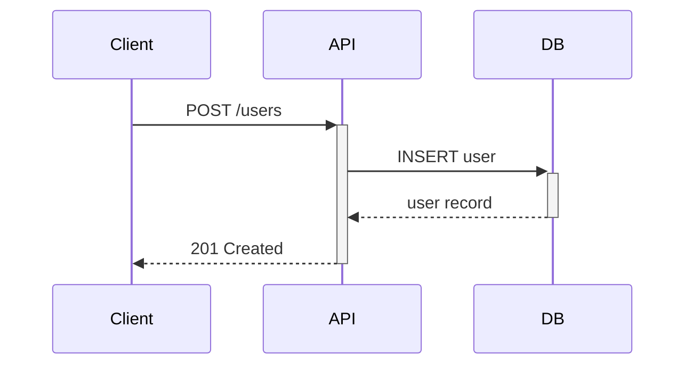

# Documentation — Domain Knowledge

## README Template

```markdown
# Project Name

One-sentence description of what this project does.

## Quick Start

\`\`\`bash
npm install
npm start
\`\`\`

## Usage

Show the most common usage pattern with a code example.

## API Reference

### `functionName(param1, param2)`

| Parameter | Type | Default | Description |
|-----------|------|---------|-------------|
| param1 | string | — | What this parameter does |
| param2 | number | 10 | Optional configuration |

**Returns:** `Promise<Result>` — Description of return value.

**Example:**
\`\`\`javascript
const result = await functionName("hello", 42);
\`\`\`

## Architecture

Brief overview of how the system is structured.

## Contributing

How to set up the development environment and submit changes.

## License

MIT
```

## JSDoc Reference

```javascript
/**
 * Brief description of what the function does.
 *
 * @param {string} name - The user's display name
 * @param {Object} options - Configuration options
 * @param {number} [options.limit=10] - Maximum results to return
 * @returns {Promise<User[]>} List of matching users
 * @throws {ValidationError} When name is empty
 *
 * @example
 * const users = await findUsers("Alice", { limit: 5 });
 */
```

## Python Docstring Reference

```python
def find_users(name: str, limit: int = 10) -> list[User]:
    """Find users matching the given name.

    Args:
        name: The user's display name to search for.
        limit: Maximum number of results to return. Defaults to 10.

    Returns:
        List of User objects matching the search criteria.

    Raises:
        ValidationError: When name is empty or whitespace-only.

    Example:
        >>> users = find_users("Alice", limit=5)
        >>> len(users)
        3
    """
```

## Architecture Diagram Patterns

### System Context (Mermaid)


### Sequence Diagram

